# Merciless Warrior: Java Swing 2D Platformer Game


<p float="left">

</p>

## Table of Contents

- [About The Project](#about-the-project)
- [Key Features](#key-features)
  - [Gameplay Features](#gameplay-features)
  - [Technical Features](#technical-features)
- [Architecture Overview](#architecture-overview)
- [Getting Started](#getting-started)
  - [Prerequisites](#prerequisites)
  - [Installation & Launch](#installation--launch)
- [Acknowledgements](#acknowledgements)
- [License](#license)

## About The Project

As a developer, my goal was to create a complete, end-to-end gaming experience that combines the nostalgia of 2D platformers with the power of modern backend technologies. "Merciless Warrior" was born out of a passion for both game development and software engineering.

The game client is intentionally built using **Java Swing**, to explore the challenges of creating a game engine from scratch.

The backend is a powerful, event-driven system designed for scalability and separation of concerns. It features a microservices architecture for core gameplay logic and a complete data pipeline using Kafka and Apache Spark for real-time analytics. This demonstrates an approach to modern application development, from the user interface to data processing.

This project is a personal journey into the depths of game creation, backend architecture, and data engineering.

## Key Features

### Gameplay Features

- **Engaging 2D Platformer Gameplay:** Navigate through diverse levels, battling a variety of enemies with unique attack patterns.
- **Rich Combat System:** Combine melee attacks, special abilities, and powerful spells to overcome foes.
- **Deep Itemization:** Buy, sell, craft, and collect a wide array of items.
- **Character Progression:** Upgrade your character by collecting coins and tokens, unlocking new perks and enhancing your abilities.
- **Open-World Structure:** Explore a connected world, with the ability to backtrack to previous levels.
- **Challenging Boss Fights:** Test your skills against formidable bosses.
- **Interactive World:** Talk to various NPCs, embark on quests, and destroy objects.
- **Dynamic Soundscapes:** Experience a rich soundscape powered by the **OpenAL** library for high-quality audio processing.
- **Save & Load System:** Save your progress locally on your computer or in the cloud to continue your adventure from anywhere.
- **Competitive Leaderboard:** Compete with other players and climb the ranks on the global leaderboard.

### Technical Features

- **Custom Game Engine:** Built entirely from scratch using Java Swing.
- **Microservices Architecture:** The backend is composed of several containerized services:
    - **Authentication Service:** Manages user registration, login, and secure JWT-based authentication. Implements rate limiting with Redis.
    - **Game Service:** Handles all core game data, including player progression, inventory, and leaderboards.
    - **Multiplayer Service:** Manages real-time game sessions, player state synchronization, and chat functionalities using WebSockets.
    - **API Gateway:** A single entry point for all client requests, routing them to the appropriate service.
    - **Service Registry:** Allows services to dynamically discover and communicate with each other.
- **Asynchronous Data & Analytics Pipeline:**
    - **Apache Kafka:** The Game Service produces events in Avro format to a Kafka topic, decoupling game logic from data analysis.
    - **Analytics Service (Scala & Apache Spark):** A dedicated service that consumes events from Kafka. It features:
        - A **Spark Structured Streaming** job to process data in real-time and write it to a Parquet-based data lake.
        - An on-demand **Spark Batch Job** to run complex queries on the data lake and generate analytical reports.
- **Containerized & Orchestrated:** The entire backend ecosystem is containerized with **Docker** and managed with **Docker Compose**.
- **Resilient & Secure by Design:**
    - The Game Service uses resilience patterns like **Circuit Breakers** and **Retries** to handle potential failures in inter-service communication.
    - The backend is secured using **Spring Security** for authentication and authorization.

## Architecture Overview

```mermaid
flowchart TD
 subgraph subGraph0["Launcher (JavaFX)"]
        LauncherUI["<b>Launcher UI 🎮</b><br>Login, Register, Settings"]
        Config["<b>Configuration ⚙️</b><br>Controls, Graphics"]
        LaunchConfig["<b>GameLaunchConfig Object 🚀</b><br>Carries settings to the game"]
  end
 subgraph subGraph1["Engine Core (Swing)"]
        GameLoop["<b>Game Loop 🔄</b><br>Drives Fixed Updates (UPS) &amp; Frames (FPS)"]
        StateManager["<b>State Manager 🕹️</b><br>Switches between game states<br><i>(Menu, Playing, Options)</i>"]
  end
 subgraph subGraph5["Active Game State"]
        GameInitializer["<b>GameInitializer 🛠️</b><br>Builds the Context"]
        GameContext["<b>GameContext 🧩</b><br>Holds &amp; Injects<br>all Managers/Services"]
        InputListeners["<b>Input Listeners ⌨️🖱️</b><br>Capture raw Keyboard &amp; Mouse events"]
        GameStateController["<b>GameStateController 🎮</b><br>Translates input into game actions"]
        GameWorld["<b>Game World 🌍</b><br>Manages:<br>• Entities<br>• GameObjects<br>• Levels <br>• Projectiles, Spells, etc..."]
        GamePanel["<b>Game Panel (Swing) 🖥️</b><br>The main canvas"]
        Camera["<b>Camera 📷</b><br>Controls viewport &amp; scrolling"]
        OverlayManager["<b>UI Overlay Manager 🗂️</b><br>Renders HUD, Inventory, Menus"]
  end
 subgraph subGraph6["Data Persistence"]
        DataPersistence["<b>Storage Strategy 💾</b><br>Abstracts data source"]
        Online["<b>Online Strategy 🌐</b><br>Uses Online Service"]
        Offline["<b>Offline Strategy 💻</b><br>Local Save Files"]
  end
 subgraph subGraph10["Service Layer (REST) 📡"]
        OnlineServiceInterface["<b>Online Service Interface</b><br>Defines data contracts"]
        RestApiClient["<b>REST API Client</b><br>Handles HTTP, Auth (JWT), JSON parsing"]
        DtoMappers["<b>DTO Mappers</b><br>Translates between DTOs & Game Models"]
  end
 subgraph subGraph8["Shared Services & Systems"]
        PhysicsEngine["<b>Physics &amp; Collision 🏋️‍♂️</b><br>CollisionDetector"]
        AudioEngine["<b>Audio Engine (OpenAL 🎧)</b><br>Sound &amp; Music Playback"]
        AssetManager["<b>Asset Manager 📦</b><br>SpriteManager - Caches all images"]
        QuestSystem["<b>Quest System 🎯</b><br>Listens for events, tracks objectives"]
        EffectSystem["<b>Effect System 💥</b><br>Particles, Lighting, Screen Shake"]
        BossHandlers["<b>Event Handlers ✨</b><br>Manages complex event logic"]
  end
 subgraph subGraph9[" "]
        subGraph0
        subGraph1
        subGraph5
        subGraph8
        subGraph6
        subGraph10
        EventBus["<b>Event Bus 🔔</b><br>Decoupled System Communication"]
  end

    LauncherUI -- Manages --> Config
    LauncherUI -- Authenticates via --> RestApiClient
    RestApiClient -- Provides Auth Token for --> LaunchConfig
    Config -- Create --> LaunchConfig
    LauncherUI -- Launches Game with --> GameLoop
    GameLoop -- Uses --> LaunchConfig
    GameLoop -- Drives --> StateManager
    StateManager -- Activates --> subGraph5
    GameInitializer -- Creates & Wires --> GameContext
    GameContext -- Is injected into --> GameWorld & GameStateController & OverlayManager
    GameContext -- Uses --> DataPersistence
    InputListeners -- Sends raw input to --> GameStateController
    GameStateController -- Issues commands to --> GameWorld
    GameStateController -- Publishes events to --> EventBus
    GameWorld -- Uses services from --> GameContext
    GameWorld -- Publishes events to --> EventBus
    GamePanel -- Renders --> GameWorld
    GamePanel -- Framed by --> Camera
    OverlayManager -- Renders UI on --> GamePanel
    GamePanel -- Requests assets from --> AssetManager
    Camera -- Requests assets from --> AssetManager
    OverlayManager -- Requests assets from --> AssetManager
    EventBus -- Notifies --> QuestSystem & EffectSystem & BossHandlers
    DataPersistence --> Online & Offline
    Online -- Uses --> OnlineServiceInterface
    OnlineServiceInterface -- Implemented by --> RestApiClient
    RestApiClient -- Uses --> DtoMappers
    subGraph0 --> subGraph9

    style LauncherUI fill:#AED6F1,stroke:#2C3E50,stroke-width:1px,color:#333
    style Config fill:#AED6F1,stroke:#2C3E50,stroke-width:1px,color:#333
    style LaunchConfig fill:#AED6F1,stroke:#2C3E50,stroke-width:1px,color:#333
    style GameLoop fill:#4C74FF,stroke:#2C3E50,stroke-width:1px,color:#FFFFFF
    style StateManager fill:#5B9BD5,stroke:#2C3E50,stroke-width:1px,color:#FFFFFF
    style GameInitializer fill:#FAD7A0,stroke:#2C3E50,stroke-width:1px,color:#333
    style GameContext fill:#F5B7B1,stroke:#D35400,stroke-width:2px,color:#333
    style InputListeners fill:#5CDB95,stroke:#2C3E50,stroke-width:1px,color:#333
    style GameStateController fill:#52BE80,stroke:#2C3E50,stroke-width:1px,color:#333
    style GameWorld fill:#FFB84D,stroke:#2C3E50,stroke-width:1px,color:#333
    style GamePanel fill:#9B59B6,stroke:#2C3E50,stroke-width:1px,color:#FFFFFF
    style Camera fill:#8E44AD,stroke:#2C3E50,stroke-width:1px,color:#FFFFFF
    style OverlayManager fill:#8E44AD,stroke:#2C3E50,stroke-width:1px,color:#FFFFFF
    style PhysicsEngine fill:#B3B6B7,stroke:#2C3E50,stroke-width:1px,color:#333
    style AudioEngine fill:#B3B6B7,stroke:#2C3E50,stroke-width:1px,color:#333
    style AssetManager fill:#B3B6B7,stroke:#2C3E50,stroke-width:1px,color:#333
    style EventBus fill:#E74C3C,stroke:#2C3E50,stroke-width:1px,color:#FFFFFF
    style DataPersistence fill:#B3B6B7,stroke:#2C3E50,stroke-width:1px,color:#333
    style Online fill:#D5F5E3,stroke:#2C3E50,stroke-width:1px,color:#333
    style Offline fill:#D5F5E3,stroke:#2C3E50,stroke-width:1px,color:#333
    style QuestSystem fill:#B3B6B7,stroke:#2C3E50,stroke-width:1px,color:#333
    style EffectSystem fill:#B3B6B7,stroke:#2C3E50,stroke-width:1px,color:#333
    style BossHandlers fill:#B3B6B7,stroke:#2C3E50,stroke-width:1px,color:#333
    style OnlineServiceInterface fill:#A3E4D7,stroke:#16A085,stroke-width:1px,color:#333
    style RestApiClient fill:#A3E4D7,stroke:#16A085,stroke-width:1px,color:#333
    style DtoMappers fill:#A3E4D7,stroke:#16A085,stroke-width:1px,color:#333
```




## Getting Started

Follow these steps to get a local copy up and running.

### Prerequisites

- **Java Development Kit (JDK) 17** or newer.
- **Docker** and **Docker Compose**.
- An IDE that supports Java/Gradle projects (e.g., IntelliJ IDEA).

### Installation & Launch

1.  **Clone the repository:**
    ```sh
    git clone https://github.com/VasilijeJukic01/MercilessWarrior-Java.git
    cd MercilessWarrior-Java
    ```

2.  **Start the Backend Services:**
    Open a terminal in the root directory and run the following Docker Compose command. This will build the images for each microservice and start them, along with the databases, Redis, and Kafka.
    ```sh
    docker-compose up --build
    ```
    Wait for all the services to start up. You can monitor the logs with `docker-compose logs -f`.

3.  **Run the Game Client:**
  - Open the `core` directory as a project in your IDE.
  - Let the IDE sync the Gradle dependencies.
  - Locate and run the `Launcher.java` file (`core/src/main/java/platformer/launcher/Launcher.java`).

    The game launcher should now appear, allowing you to start playing!

## Acknowledgements

- **My Friends:** This project was a solo development effort, but it would not have been the same without the invaluable ideas, feedback, and encouragement from my friends. Your creativity helped shape the world of "Merciless Warrior." A special thank you to:
  - **[Danilo J.](https://rs.linkedin.com/in/danilojoncic)**
  - **Stevan B.**
  - **Jovan P.**
  - **[Mehmedalija K.](https://rs.linkedin.com/in/mehmedalija-karisik)**
  - **Marija P.**

- **Asset Credits:**
  - **Art:** [Dreamir](https://dreamir.itch.io/), [Maaot](https://maaot.itch.io/), [brullov](https://brullov.itch.io/), [CreativeKind](https://creativekind.itch.io/)
  - **Music:** Matthias Verbinnen

## License

This project is licensed under the [AGPLv3 License](LICENSE).
